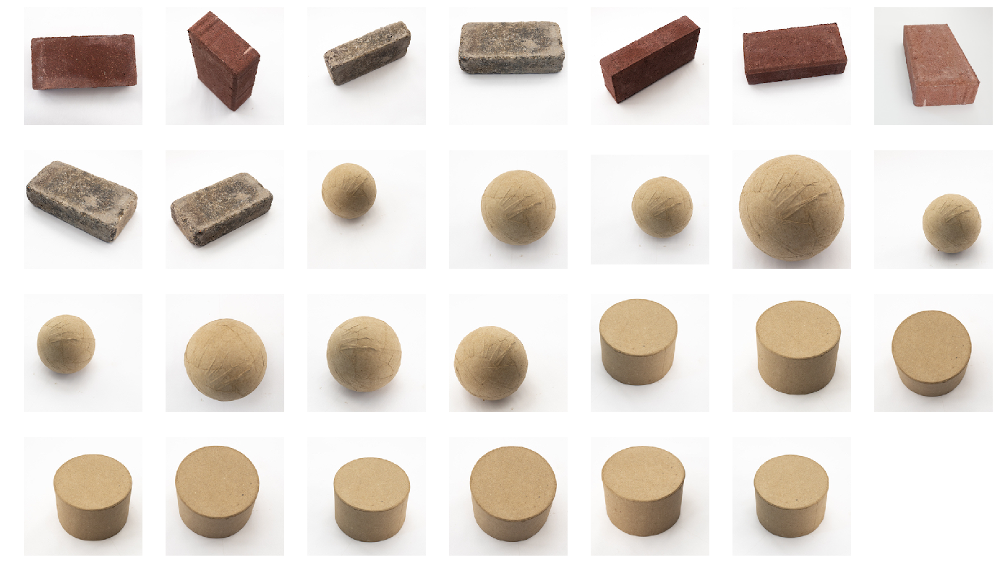

# The Original Problem


**Computer Vision** has a very interesting history. It's roots really go all the way back to the beginning of computing and **Artifical Intelligence.** In these early days, it was completely unknown just how easy or difficult it would be to recreate the function of the human visual system. A great example of this is the 1966 MIT Summer Vision Project. Marvin Minsky and Seymour Papert, co-directors of the MIT AI Labratory, begun the summer with some ambitious goals:


Minsky and Papert assigned Gerald Sussman, an MIT undergraduate studunt as project lead, and setup specific goals for the group around recognizing specific objects in images, and seperating these objects from their backgrounds. 


Just how hard is it to acheive the goals Minsky and Papert laid out? How has the field of computer vision advance since that summer? Are these tasks trivial now, 50+ years later? Do we understand how the human visual system works? Just how hard *is* computer vision and how far have we come?


## This Repository

This repository is all about spending some time the with **the original problem** posed by Minsky and Papert. Working through this problem is a great way to begin learning **computer vision.** 


The repository is broadly divided into two areas: notebooks and a programming challenge.

## Notebooks

| Section |   Notebook    | Recommended Reading/Viewing | Additional Reading/Viewing | Code Developed | 
| ------- | ------------- | --------------------------- | -------------------------- | -------------- |
| 0       | The Original Problem | [The Summer Vision Project](papers/summer_vision_project.pdf) | - | - |
| 1 | A Little About Python and Jupyter | | [Scientific Python Introduction](http://hplgit.github.io/bumpy/doc/pub/basics.html) | - | 
| 2       | Edges | [**Only Abstact and Pages 25-27 **Machine perception of 3d solids**](papers/roberts_thesis.pdf)| - | convert_to_grayscale, roberts_cross |
| 3 | Image Filtering | [How Blurs & Filters Work - Computerphile](https://youtu.be/C_zFhWdM4ic) | - | - |


## Programming Challenge

### Instructions

- Write a method `classify.py` that takes in an image and returns a prediction - ball, brick, or cylinder.
- An example script in located in challenge/sample_student.py
- Your script will be automatically evaluated on a set of test images. 
- The testing images are quite similar to the training images, and organized into the same difficulty categories. 
- You are allowed 10 submissions to the evaluation server, which will provide immediate feedback.

### The Data

#### Easy Examples


### Grading 
Following the progression set out the MIT the summer project, we'll start with easy images, and move to more difficult image with more complex backgrounds as we progress. For each difficulty level, we will compute the average accuracy of your classifier. We will then compute an average overall accuracy, weighting easier examples more: 

````
overall_accuracy = 0.5*accuracy_easy 
                 + 0.2*accuracy_medium_1 
                 + 0.2*accuracy_medium_2 
                 + 0.1*accuracy_hard 
````

| Overall Accuracy | Points |
| ------------- |:-------------:| 
| >= 0.6         | 10/10 | 
| 0.55 <= a < 0.6  | 9/10|  
| 0.5 <= a < 0.55 | 8/10 |   
| 0.45 <= a < 0.5 | 7/10 | 
| 0.40 <= a < 0.45 | 6/10 | 
| 0.35 <= a < 0.40 | 5/10 | 
| a < 0.35 | 4/10 |
| Non-running code | 0/10|

#### A quick note on difficulty
Depending on your background, this challenge may feel a bit like getting thrown into the deep end. If it feels a bit daunting - that's ok! Half of the purpose of this assignement is to help you develop an appreciation for **why** computer vision is so hard. As you may have already guessed, Misky, Sussman, and Papert did **not** reach their summer goals - and I'm not expecting you to either. The grading table above reflects this - for example, if you're able to get 90% accuracy on the easy examples, and simply guess randomly on the rest of the examples, you'll earn 10/10 points. 

## Setup 

The Python 3 [Anaconda Distribution](https://www.anaconda.com/download) is the easiest way to get going with the notebooks and code presented here. 

(Optional) You may want to create a virtual environment for this repository: 

~~~
conda create -n cv python=3 
source activate cv
~~~

You'll need to install the jupyter notebook to run the notebooks:

~~~
conda install jupyter

# You may also want to install nb_conda (Enables some nice things like change virtual environments within the notebook)
conda install nb_conda
~~~

This repository requires the installation of a few extra packages, you can install them all at once with:
~~~
pip install -r requirements.txt
~~~

(Optional) [jupyterthemes](https://github.com/dunovank/jupyter-themes) can be nice when presenting notebooks, as it offers some cleaner visual themes than the stock notebook, and makes it easy to adjust the default font size for code, markdown, etc. You can install with pip: 

~~~
pip install jupyterthemes
~~~

Recommend jupyter them for presenting these notebook (type into terminal before launching notebook):

~~~
jt -t grade3 -cellw=90% -fs=20 -tfs=20 -ofs=20 -dfs=20
~~~

### Downloading Data
For larger files such as data and videos, I've provided download scripts to download these files from welchlabs.io. These files can be pretty big, so you may want to grab a cup of your favorite beverage to enjoy while downloading. The script can be run from within the jupyter notebooks or from the terminal:

~~~
python util/get_and_unpack.py -url http://www.welchlabs.io/unccv/the_original_problem/data/data.zip
~~~

Alternatively, you can download [download data manually](http://www.welchlabs.io/unccv/the_original_problem/data/data.zip), unzip and place in this directory. 


### Downloading Videos

Run the script below or call it from the notebooks:

~~~
python util/get_and_unpack.py -url http://www.welchlabs.io/unccv/the_original_problem/videos.zip
~~~

Alternatively, you can download [download videos manually](http://www.welchlabs.io/unccv/the_original_problem/videos.zip), unzip and place in this directory. 


